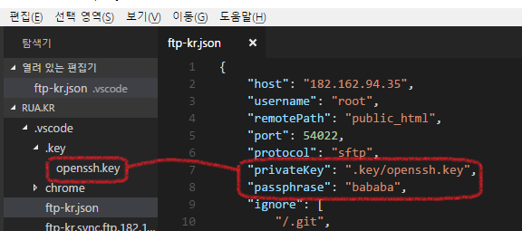
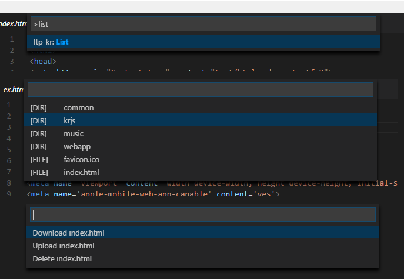

# 1.3.14
* bugfix - SFTP alt server error
* bugfix - Tree view after config updated
* SSH password re-ask
* append js.map for debugging

# 1.3.13
* sftp exec bug fix (about stream count limit)

# 1.3.12
* Fix init error
* Fix too many request view & list problem

# 1.3.11
* Fix diff

# 1.3.10
* Bugfix about cache

# 1.3.9
* Download/Clean All fix

# 1.3.8
* Crash bug fix

# 1.3.7
* minor bug fix

# 1.3.6
* minor bug fix

# 1.3.5
* Show warning if ftp-kr.json is uploaded

# 1.3.4
* "ignore" field bug fix
* Reduce reconnection when modify ftp-kr.json

# 1.3.3
* SSH Terminal Support!
* Suppress error when file not found in tree view

# 1.3.2
* `task.json` extra command (`upload from 'path'` & `download to 'path'`)

# 1.3.1
* Connection auto canceling when save config

# 1.3.0
* FTP TREE VIEW!
* `ftp-kr: Target` - Change the main server
* `task.json` extra command (`upload to 'path'` & `download from 'path'`)
* Force disconnecting before reconnecting

# 1.2.17
* `autoDelete` bug fix

# 1.2.16
* add `ignoreRemoteModification` option
* add `ftp-kr: Run task.json` command

# 1.2.15
* bug fix
* remove FTP Explorer dummy view

# 1.2.14
* Fix linux error

# 1.2.13
* Conflict check and diff when auto upload
* Reuse cache file

# 1.2.12
* Diff!

# 1.2.11
* Fix autoDownload bug

# 1.2.10
* Fix directory auto generation

# 1.2.9
* Update algorithms field of ssh2 schema json

# 1.2.8
* Fix FTP/SFTP connection exception

# 1.2.7
* Fix SFTP connection exception

# 1.2.6
* Fix path normalize error

# 1.2.5
* Windows share path error fix

# 1.2.4
* Bugfix about path

# 1.2.3
* Fix *All commands
* Fix list-download without local directory

# 1.2.2
* Fix that localBasePath is not activated if it is ends with slash
* Fix that ftp-kr.task.json is generated at root
* Add `followLink` option (Symlink support)

# 1.2.1
* Add reconnect command & block detecting
* Add `localBasePath` option
* Fix remote modification detection

# 1.2.0
* Remove closure compiler
* Multi workspace support
* Download/Upload Directory (in `ftp-kr.list` command)
* Multi Server Support
* Add Icon!

## header.header

# 1.1.7
* Fix `Init` command

# 1.1.6
* FTP fix: Fix `Cancel All` & `Download All` & `List` commands
* FTP fix: Password fail reconnect

# 1.1.5
* Change ignore list to use previous feature
* FTP rmdir bug fix when path has white space

# 1.1.4
* Change ignore list to use glob pattern
* Ignore ENOENT error while upload

# 1.1.3
* Fix closure compiler error

# 1.1.2
* Fix closure compiler error

# 1.1.1
* Fix `Download All` command
* Update Closure Compiler schema

# 1.1.0
* Cancel connection if config file is changed
* Add `Cancel All` command
* Prompt password when `password` field is not existed
* Ignore directory not found error by `remotePath`
* Closure Compiler update(closure-compiler-v20170806)
* Add new bug what i don't know

# 1.0.14
* Add logLevel option to config

# 1.0.13
* Suppress duplicated input(Closure Compiler)
* Save latest compile target(Closure Compiler)

# 1.0.12
* Whether or not ftp-kr is busy, reserve auto upload/download

# 1.0.11
* Show last error when use command with invalid configuration

# 1.0.10
* Change encoding of sftp file transfer from utf-8 to binary

# 1.0.9
* Fix about list 550 error
* Fix upload & download with shortcut

# 1.0.8
* Fix tree upload by watcher
* Auto save batch list when press OK
* Bypass reupload issue

# 1.0.7
* Stop create test.txt

# 1.0.6
* Fix autoDownload bug... maybe?

# 1.0.5
* Changing infotext for reviewing sync remote to local operations.
* Open log when upload/download manually

# 1.0.4
* Fix autoDownload bug... maybe not...

# 1.0.3
* Nothing

# 1.0.2
* Use error code instead of error number when exception check for OS compatibility
* Remove unusing files

# 1.0.1
* Bug fix

# 1.0.0
* Set version to 1.0.0 without much meaning
* Port all javascript to typescript
* Use ftp-ssl when set protocol to `ftps`
* Add `ftpOverride` and `sftpOverride` field, It can force override option of ftp/sftp connection

# 0.0.26
* Fix SFTP private key absolute path problem

# 0.0.25
* SFTP private key support  

# 0.0.24
* Update Closure compiler to v20170124

# 0.0.23
* Add `autoDownload` option, It check modification and download every opening

# 0.0.22
* Add connectionTimeout option
* Do not opens up output for every connection

# 0.0.21
* Fix ignore list did not apply to `Download/Clean All` command
* Reverse ordering of CHANGELOG.md
* Add `List` command  

# 0.0.20
* Fix `Download/Clean All` commands
* Add `Refresh All` command

# 0.0.19
* Add missing module

# 0.0.18
* Show notification when task takes longer then 1 second
* Add SFTP support
* Fix `Upload/Download this` in file menu
* If use `Upload/Download this` at directory it will use `Upload/Download All` command

# 0.0.17
* Add generate button when not found make.json

# 0.0.16
* Update closure compiler to v20161201

# 0.0.15
* Fix disableFtp option

# 0.0.14
* Add disableFtp option

# 0.0.13
* Fix invalid error when multiple init command
* Add detail button in error message
* Add image to README.md

# 0.0.12
* Change output as ftp-kr when use Closure-Compiler
* If make.json is not found use the latest one

# 0.0.11
* Add config.createSyncCache option! default is true
* Implement array option inheritance for Closure-Compiler settings!
* Add json schema
* Make Json command will add new config field

# 0.0.10
* Fix Closure-Compiler variable option remapping

# 0.0.9
* Split config.autosync -> config.autoUpload & config.autoDelete
* Set default value of config.autoDelete as false
* Init command will add new config field

# 0.0.8
* Add config.fileNameEncoding option!
* Fix being mute with wrong connection
* Fix Upload All command
* Fix Closure Compile All command
* Do not stop batch work even occured error

# 0.0.7
* Fix download all command

# 0.0.6
* Fix init command

# 0.0.5
* Fix creating dot ended directory when open

# 0.0.4
* Fix init command not found error (npm package dependency error)
* Fix init command error when not exists .vscode folder
* Fix ignorePath error of init command when use twice
* Fix download all command
* Decide to use MIT license

# 0.0.3
* Add git repository address!

# 0.0.2
* Fix Closure-Compiler
* Add Download This command
* Add Upload This command 

# 0.0.1
* I publish It!
