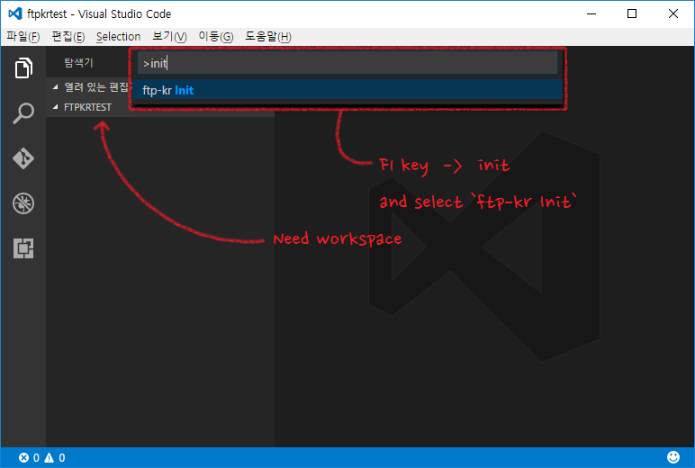
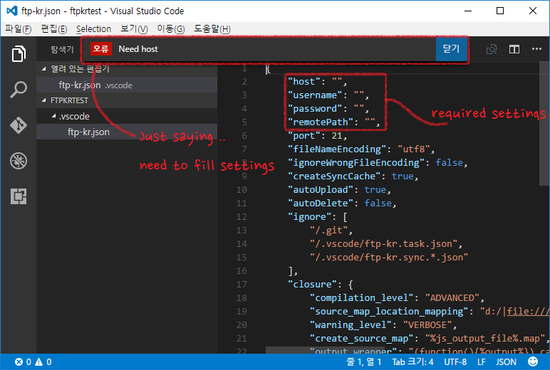
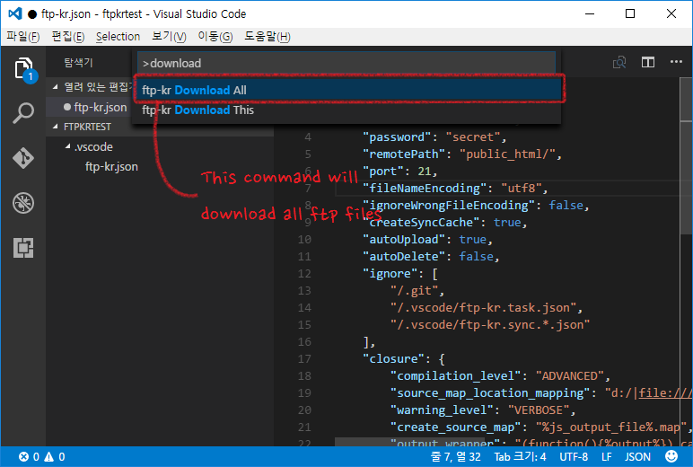

# ftp-kr README

This is FTP + Closure Compiler Extension for ME!  
I'm not good at english, Sorry for my bad english ㅠㅠ

Start with `ftp-kr Init` command! (When exists workspace)

By default, the auto-sync feature is enabled  
If you want to disable, please set autoUpload/autoDelete to false

## Functions
FTP Functions:
* Real-Time FTP synchronization(You can off it!)
* Upload All without Same size file
* Download All without exists file
* Cleaning FTP files that Not in workspace
* Same file size -> It is Latest! -> Do not upload or download

Closure Compiler Functions:
* Compile to command "ftp-kr Closure Compile"
* Parse &lt;reference&gt; tag to include other js

## Available commands
* `ftp-kr: Init` - Create ftp-kr.json.
* `ftp-kr: Upload All` - Upload all files.
* `ftp-kr: Download All` - Download all files.
* `ftp-kr: Upload This` - Upload this file.
* `ftp-kr: Download This` - Download this file.
* `ftp-kr: Refresh All` - Rescan remote files.
* `ftp-kr: Clean All` - Cleaning remote files that Not in workspace.

## Available commands about Closure Compiler

* `ftp-kr: Make Json` - Create config file of Closure Compiler as make.json.
* `ftp-kr: Closure Compile` - Compile by makejson from directory of opened file!
* `ftp-kr: Closure Compile All` - Compile all of make.json in workspace!

**Enjoy!**