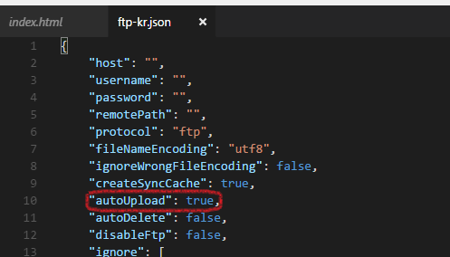

# ftp-kr README

This is FTP + Closure Compiler Extension for ME!  
I'm not good at english, Sorry for my bad english ㅠㅠ

Start with `ftp-kr Init` command! (When exists workspace)

By default, the auto-sync feature is enabled  
If you want to disable auto-sync, please set autoUpload/autoDelete to false  

You can browse remote directory with `ftp-kr List` command!  

You can use SFTP with private key!  

You can override ftp/sftp options by `ftpOverride`/`sftpOverride` field, It will pass to connect function of `ftp`/`ssh2-sftp-client` package.

## Available functions & commands
* Real-Time FTP/SFTP synchronization(You can off it!)
* This extension check modification with file size
* `ftp-kr: Init` - Create ftp-kr.json.
* `ftp-kr: Upload All` - Upload all without same size file
* `ftp-kr: Download All` - Download all without exists file
* `ftp-kr: Upload This` - Upload this file.
* `ftp-kr: Download This` - Download this file.
* `ftp-kr: Refresh All` - Rescan remote files.
* `ftp-kr: Clean All` - Cleaning remote files that not in workspace.
* `ftp-kr: Refresh All` - Cleaning remote file list cache.
* `ftp-kr: List` - Browse remote directory.

## Available functions & commands about Closure Compiler
* Parse &lt;reference&gt; tag to include other js
* `ftp-kr: Make Json` - Create config file of Closure Compiler as make.json.
* `ftp-kr: Closure Compile` - Compile by makejson from directory of opened file!
* `ftp-kr: Closure Compile All` - Compile all of make.json in workspace!

**Enjoy!**